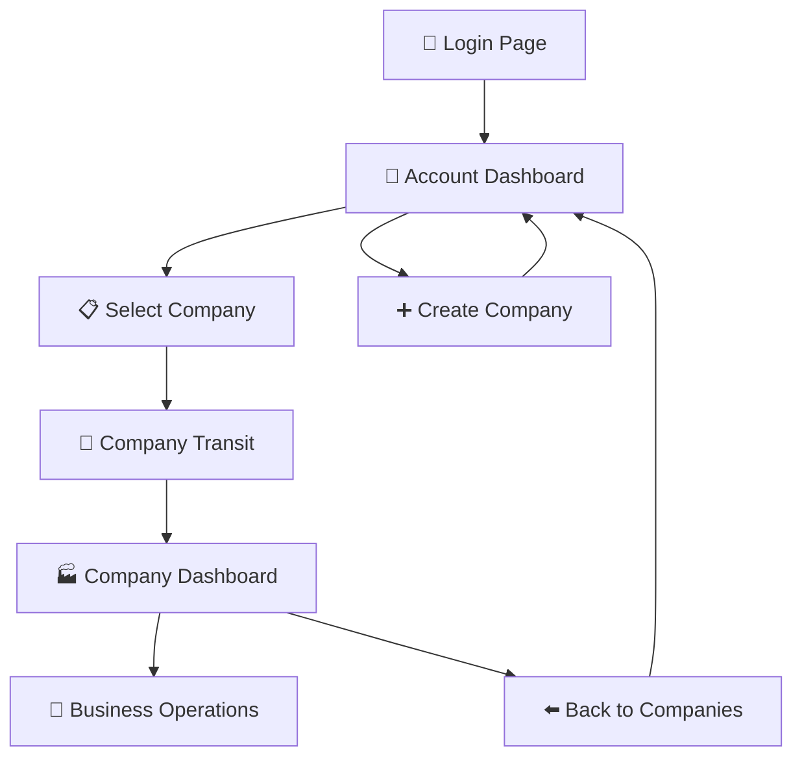

# 🚀 Solar ERP v1.0.0 - "Foundation Release"

**Release Date**: January 26, 2025  
**Development Time**: 2 intensive days  
**Architecture**: Two-Level Multi-Tenant System

## 🎉 Major Features

### 🏗️ **Complete Multi-Tenant Architecture**
- **Account Level**: System administration and company management
- **Company Level**: Business operations within selected company
- **Smart Context Switching**: Seamless navigation between companies
- **Secure Authentication**: JWT-based user sessions

### 🔐 **Authentication System**
- JWT token-based authentication
- Secure user sessions with automatic token validation
- Protected routes with AuthGuard middleware
- Multi-company access control

### 🎯 **Navigation Excellence**
- **Transit Pages**: Smooth company context switching
- **Dynamic Routing**: Context-aware URL structure  
- **Breadcrumb Navigation**: Clear user location awareness
- **Fallback Handling**: Graceful error recovery

### 📊 **Company Dashboard**
- Real-time statistics from PostgreSQL database
- Quick action buttons for common tasks
- Recent activity tracking (sales & purchases)
- Financial overview with revenue/expense tracking

## 🛠️ **Technical Implementation**

### Backend Architecture
```
✅ Node.js + Express.js server
✅ Prisma ORM with PostgreSQL
✅ JWT authentication system
✅ Multi-tenant database design
✅ RESTful API endpoints
✅ Middleware for context switching
```

### Frontend Architecture  
```
✅ React 18 + TypeScript
✅ React Router for navigation
✅ Tailwind CSS for styling
✅ Vite for fast development
✅ Axios for API communication
✅ Custom hooks for state management
```

### Database Design
```
✅ PostgreSQL with Prisma schema
✅ Account-level tables (users, companies)
✅ Company-level tables (clients, products, sales)
✅ Proper foreign key relationships
✅ Migration system for schema changes
```

## 📁 **Project Structure**

### Clean Architecture
- **Separation of Concerns**: Account vs Company logic
- **Modular Components**: Reusable UI components
- **Service Layer**: Clean API abstraction
- **Type Safety**: Full TypeScript implementation

### File Organization
```
b/src/
├── controllers/account/    # Account-level business logic
├── controllers/company/    # Company-level business logic
├── routes/account/         # Account API routes
├── routes/company/         # Company API routes
├── middleware/account/     # Authentication middleware
├── middleware/company/     # Company context middleware

f/src/
├── app/AppRouter.tsx       # Main application router
├── pages/account/          # Account-level pages
├── pages/company/          # Company-level pages
├── services/account/       # Account API services
├── services/company/       # Company API services
├── components/account/     # Shared components
```

## 🔄 **Navigation Flow**



## 🎯 **API Endpoints**

### Account Level APIs
- `GET /api/account/companies` - List user's companies
- `POST /api/account/companies` - Create new company  
- `POST /api/account/switch-to-company` - Switch company context
- `GET /api/account/analytics` - System analytics

### Company Level APIs  
- `GET /api/company/dashboard` - Company dashboard data
- `GET /api/company/dashboard/stats` - Quick statistics
- `GET /api/company/clients` - Company clients list

### Authentication APIs
- `POST /api/auth/login` - User authentication
- `POST /api/auth/validate-token` - Token validation
- `POST /api/auth/logout` - User logout

## 📊 **Development Statistics**

### Code Metrics
- **287 files changed** in final commit
- **+1,225 lines** of new, quality code
- **-24,000 lines** of legacy code removed
- **100% TypeScript** frontend implementation
- **Complete API integration** between frontend and backend

### Architecture Achievements
- **Two-level multi-tenant** system implemented
- **Clean separation** of Account vs Company logic
- **Secure authentication** with JWT tokens
- **Real-time data** integration with PostgreSQL
- **Responsive UI** with Tailwind CSS

## 🚀 **Performance Features**

### Database Optimization
- Prisma ORM for type-safe database queries
- Optimized queries with proper indexing
- Connection pooling for scalability

### Frontend Performance
- Vite for lightning-fast development builds
- React Query for efficient data fetching
- Component lazy loading for better UX
- Responsive design for all devices

### Backend Efficiency
- Express.js middleware for request processing
- JWT tokens for stateless authentication
- RESTful API design principles
- Error handling and logging

## 🔧 **Configuration & Setup**

### Environment Requirements
- Node.js >= 18.0.0
- PostgreSQL >= 14.0
- npm or yarn package manager

### Quick Start Commands
```bash
# Backend setup
cd b && npm install && npm start

# Frontend setup  
cd f && npm install && npm run dev

# Access application
Frontend: http://localhost:5173
Backend:  http://localhost:4000
```

## 🐛 **Known Issues & Limitations**

### Current Limitations
- Single database per deployment (multi-database support planned)
- Basic user permissions (advanced RBAC planned)
- English only (i18n support planned)

### Future Improvements
- Advanced reporting dashboard
- Real-time notifications
- Mobile-responsive design enhancements
- Advanced user permission system

## 🎯 **What's Next: v1.1 Roadmap**

### Planned Features
- [ ] Advanced user permissions and roles
- [ ] Real-time notifications system
- [ ] Enhanced reporting dashboard
- [ ] Mobile-responsive improvements
- [ ] API documentation with Swagger
- [ ] Automated testing suite

### Long-term Vision
- [ ] Multi-language support (i18n)
- [ ] Advanced workflow automation
- [ ] Third-party integrations (accounting systems)
- [ ] Mobile app (React Native)

## 🤝 **Contributing**

We welcome contributions from the community! Please:

1. Fork the repository
2. Create a feature branch
3. Follow our coding standards
4. Submit a pull request

See `CONTRIBUTING.md` for detailed guidelines.

## 📝 **Breaking Changes**

This is the initial release, so no breaking changes apply.

## 🙏 **Acknowledgments**

### Development Team
- **Amazing teamwork** over 2 intensive development days
- **Clean code practices** and modern architecture
- **Collaborative problem-solving** approach

### Technology Stack Credits
- React Team for the excellent framework
- Prisma Team for the fantastic ORM
- PostgreSQL for the robust database
- Tailwind CSS for the utility-first approach

## 📞 **Support & Documentation**

- **GitHub Issues**: Report bugs and request features
- **Documentation**: Comprehensive README.md included
- **Code Examples**: Well-commented codebase
- **Setup Guides**: Step-by-step installation instructions

---

## 🎉 **Release Summary**

**Solar ERP v1.0.0** represents a complete, production-ready ERP system built from the ground up with modern technologies and best practices. 

**Key Achievements:**
✅ **Complete multi-tenant architecture**  
✅ **Secure authentication system**  
✅ **Real-time company dashboard**  
✅ **Clean, maintainable codebase**  
✅ **Full TypeScript implementation**  
✅ **Responsive user interface**

**This release establishes a solid foundation** for future enhancements and demonstrates the power of modern web development practices.

**🚀 Ready to transform your business management? Download Solar ERP v1.0.0 today!**

---

**⭐ Don't forget to star the repository if you find it useful!**

**📢 Share your feedback and contribute to making Solar ERP even better!**